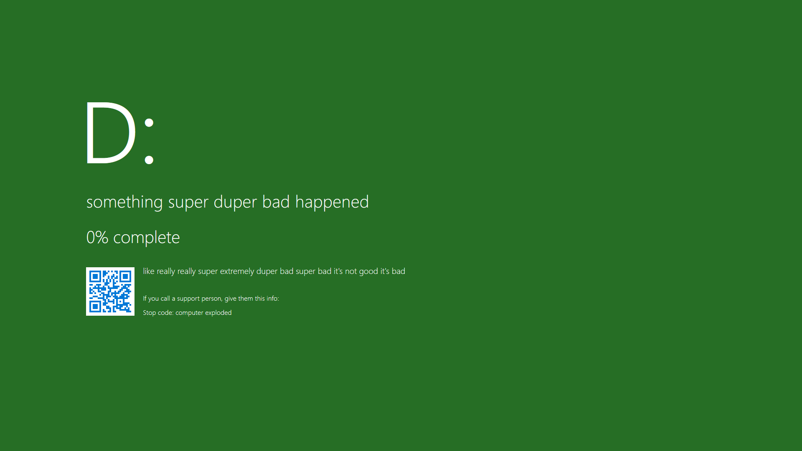
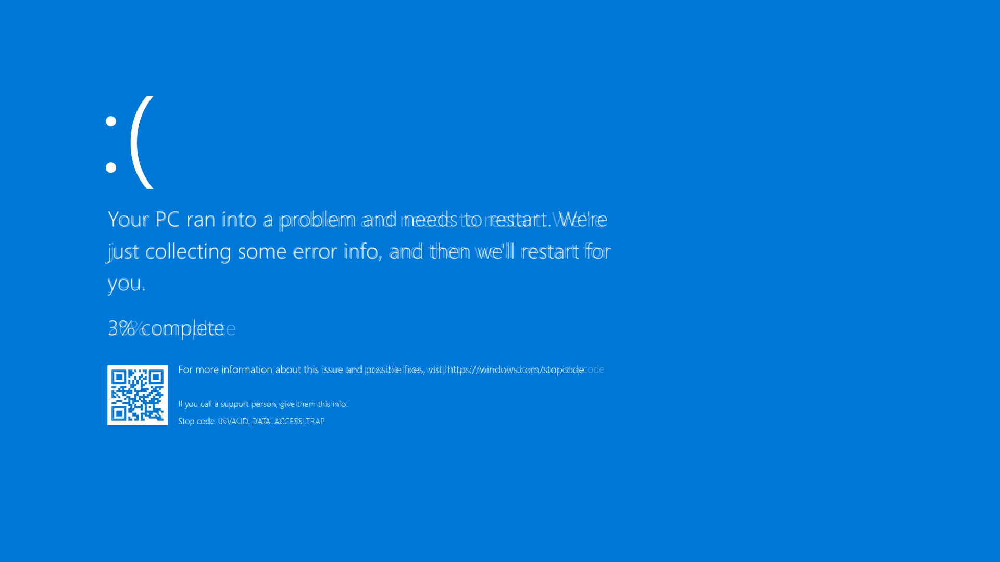

# BYOBSoD
> Bring Your Own Blue Screen of Death

Put a fake Windows 10-ish BSOD on your screen. Because why not.

## Developing
Install dependencies, run the `dev` script. `build` to build.

## Why does this exist?
I needed a recordable Blue Screen of Death on my screen, but I couldn't find anything accurate enough. Some BSOD generators I found had grammatical errors or were outdated. I didn't want to use images, as they wouldn't have an updating progress percentage. Manually triggered BSODs also have a "MANUALLY_TRIGGERED" stop code.

So I made this instead. For a three second gag.

Worth.

### How accurate is it?
I tried to get things as accurate as possible, with an overlaid image. Tested in Firefox, experience in other browsers may vary. Kerning is a bit off, vertical spacing isn't perfect.
It also looks like Windows 11's BSOD has different vertical spacing around the QR code.
Overlaid image of BSOD on top of this below.

## License
[MIT License](./LICENSE.txt).
